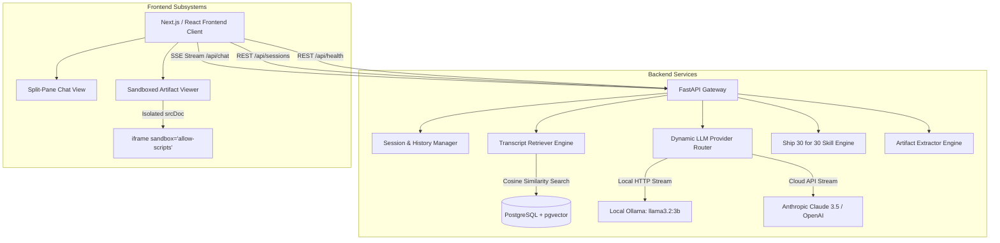
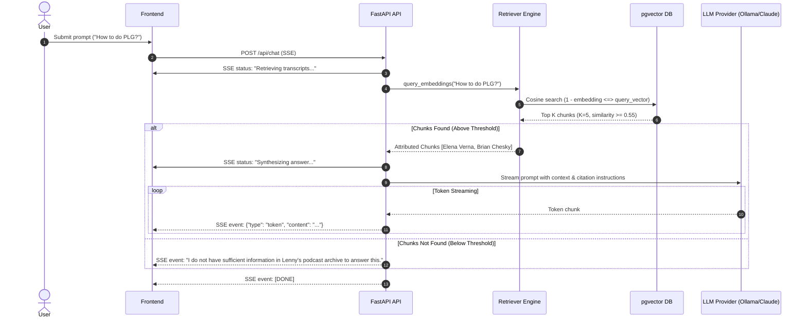

# System Architecture Specification
## The Lenny Growth Assistant

### 1. High-Level System Architecture



---

### 2. Relational & Vector Database Schema

The database uses PostgreSQL with the `pgvector` extension.

#### 2.1 Table: `chat_sessions`
Represents an ongoing chat thread with independent context.
* `id`: `UUID` (Primary Key, default `gen_random_uuid()`)
* `title`: `VARCHAR(255)` (Auto-generated from first user message)
* `created_at`: `TIMESTAMP WITH TIME ZONE` (default `NOW()`)
* `updated_at`: `TIMESTAMP WITH TIME ZONE` (default `NOW()`)

#### 2.2 Table: `chat_messages`
Stores conversation history, assistant responses, and retrieval sources.
* `id`: `UUID` (Primary Key)
* `session_id`: `UUID` (Foreign Key $\rightarrow$ `chat_sessions.id` ON DELETE CASCADE)
* `role`: `VARCHAR(50)` (`user` | `assistant` | `system`)
* `content`: `TEXT` (Full message text)
* `sources`: `JSONB` (Array of retrieved citations: episode, guest, timestamp, score)
* `provider`: `VARCHAR(50)` (`ollama` | `claude`)
* `created_at`: `TIMESTAMP WITH TIME ZONE`

#### 2.3 Table: `transcript_chunks`
Stores podcast transcript segments and high-dimensional vector embeddings.
* `id`: `SERIAL` (Primary Key)
* `episode_title`: `VARCHAR(255)`
* `guest_name`: `VARCHAR(255)`
* `topic`: `VARCHAR(255)`
* `timestamp_ref`: `VARCHAR(50)`
* `chunk_text`: `TEXT` (Target: 500–800 tokens)
* `token_count`: `INTEGER`
* `embedding`: `VECTOR(384)` (384-dimensional vector from MiniLM-L6 or nomic-embed)

**Vector Indexing:**
```sql
CREATE INDEX IF NOT EXISTS idx_transcript_chunks_embedding 
ON transcript_chunks 
USING hnsw (embedding vector_cosine_ops)
WITH (m = 16, ef_construction = 64);
```

#### 2.4 Table: `artifacts`
Tracks generated interactive artifacts.
* `id`: `UUID` (Primary Key)
* `message_id`: `UUID` (Foreign Key $\rightarrow$ `chat_messages.id`)
* `artifact_type`: `VARCHAR(50)` (`html` | `markdown` | `svg`)
* `title`: `VARCHAR(255)`
* `content`: `TEXT`
* `created_at`: `TIMESTAMP WITH TIME ZONE`

---

### 3. Retrieval-Augmented Generation (RAG) Flow



---

### 4. Dynamic LLM Provider Architecture

The system uses an object-oriented Strategy Pattern:

```python
class BaseLLMProvider(ABC):
    @abstractmethod
    async def generate_response(
        self,
        messages: List[Dict[str, str]],
        system_prompt: str,
        temperature: float = 0.3
    ) -> AsyncGenerator[str, None]:
        pass
```

1. **`OllamaProvider`:** Communicates with Ollama's local HTTP API (`/api/chat`). Features automatic connection retry, configurable stream chunking, and local hardware optimization.
2. **`CloudProvider` (Anthropic / OpenAI):** Async SDK client. Supports Claude 3.5 Sonnet streaming with structured error handling when API keys are absent.
3. **Provider Factory (`get_llm_provider`):** Dynamically resolves provider based on client request header or body (`provider: "ollama" | "claude"`), allowing evaluators to switch models per query.

---

### 5. Claude-Style Artifact Extraction & Security Isolation

#### 5.1 Extraction Mechanism
The LLM generates artifacts enclosed in custom tags:
```html
<artifact type="html" title="PLG Funnel Calculator">
<!DOCTYPE html>
<html>
...
</html>
</artifact>
```
The streaming parser detects opening and closing tags in real-time, splits the stream into conversational text and artifact payload, and notifies the client to dock the viewer.

#### 5.2 Security Model
```
┌─────────────────────────────────────────────────────────┐
│ Parent Application: http://localhost:3000              │
│ (Holds user session, chat state, cookies, local storage)│
│                                                         │
│   ┌──────────────────────────────────────────────────┐  │
│   │ <iframe                                          │  │
│   │   sandbox="allow-scripts"                        │  │
│   │   srcdoc="<sanitized_html>" />                   │  │
│   │                                                  │  │
│   │   • Isolated execution context                   │  │
│   │   • NO access to parent window / DOM             │  │
│   │   • NO access to localStorage or cookies         │  │
│   │   • Scripts run safely for UI interactivity      │  │
│   └──────────────────────────────────────────────────┘  │
└─────────────────────────────────────────────────────────┘
```
* **Attribute Enforcement:** `sandbox="allow-scripts"` allows JavaScript execution for interactive components (calculators, sliders, charts) but intentionally omits `allow-same-origin`.
* **Sanitization:** All HTML passes through `DOMPurify.sanitize` with whitelisted tags and attributes prior to injection into `srcDoc`.

---

### 6. Deployment Topology

The entire application runs via a multi-container Docker Compose mesh:
* **Service `db`:** `pgvector/pgvector:pg16` on port `5432` with volume persistence.
* **Service `backend`:** Python 3.11 FastAPI container exposing port `8000`. Connects to host Ollama via `host.docker.internal:11434`.
* **Service `frontend`:** Node.js/Next.js container exposing port `3000`.
